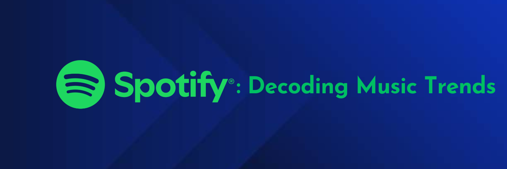

## Project Information

Our project aims to explore the association between popularity of songs and qualities of those songs that can be quantified. To do so, we explored two datasets from Kaggle inclusive of Spotify's most stream songs  by year for 2023 and 2024. Given the data available, we performed different analyses per year. We also created a combined dataset and performed cross-year analyses, where available and appropriate. 

We encourage you to explore our website, project screencast, and report. 

## Screencast

