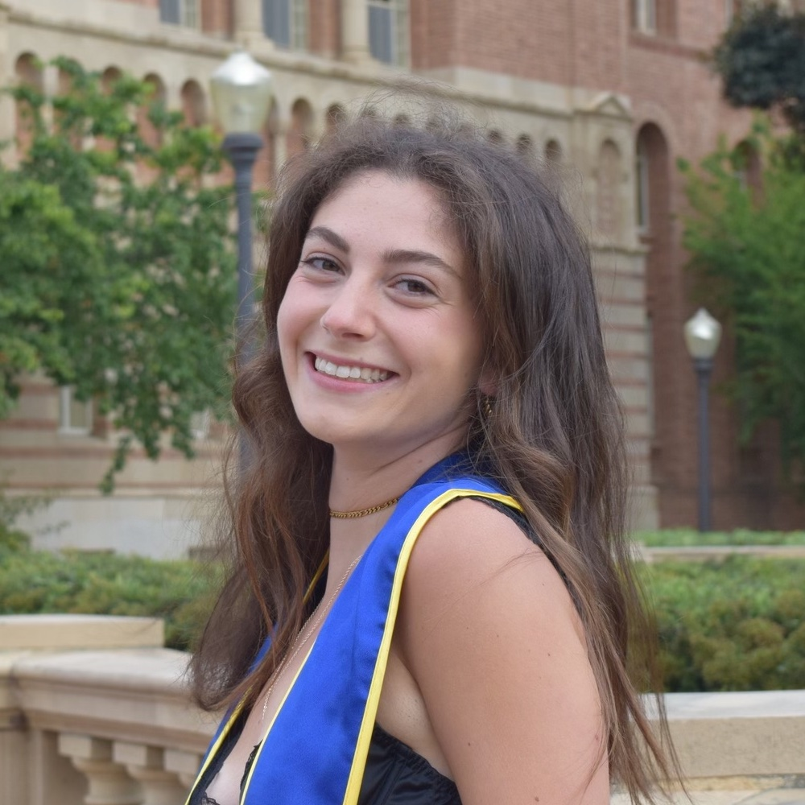
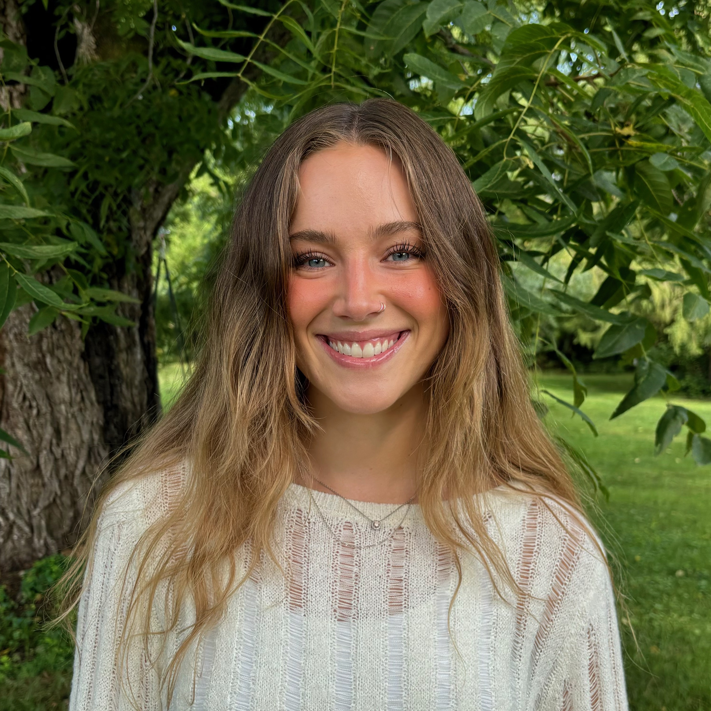

```{r include=FALSE}
library(magick)
```

<div style="text-align: center;">
Meet our project team, and feel free to reach out to any of us to connect!
</div>


<div style="display: grid; justify-items: start;">

#  Meredith Steinberg | [LinkedIn](https://www.linkedin.com/in/meredith-steinberg/)

<br>

#  Laura Bulmer | [LinkedIn](www.linkedin.com/in/laura-bulmer-935ab4171)

<br>

#  Anne Gorman | [LinkedIn](https://www.linkedin.com/in/annie-gorman-216a47257/)

<br>

#  Iris Hart | [LinkedIn](https://www.linkedin.com/in/irishart/)

<br>

#  Mia Isaacs | [LinkedIn](www.linkedin.com/in/miaisaacs)

<br>

#  Carolyn Martinez Jorge | [LinkedIn](https://www.linkedin.com/in/carolyn-martinez12/)

</div>